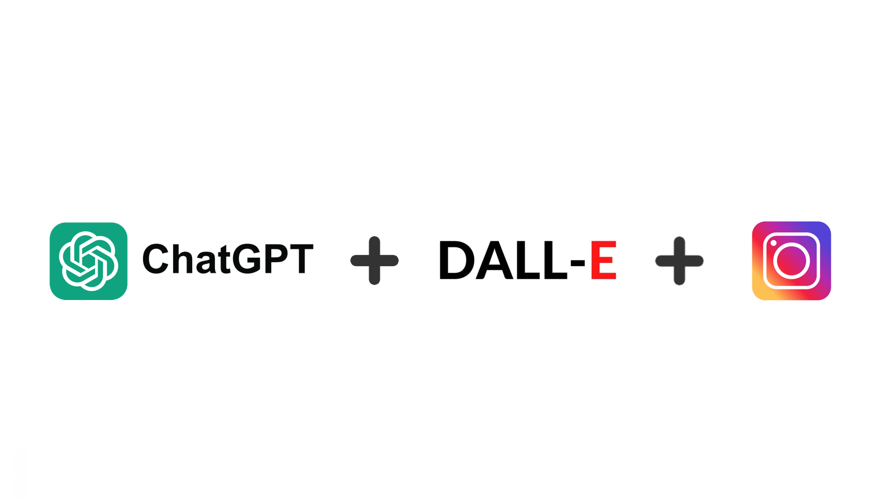

InstaGPT
=========



Description
---------------

This is an experimental automated instagram manager, showcasing capabilities of the large language model [ChatGPT]("https://openai.com/chatgpt") and text-to-image model [Dall-E](https://openai.com/dall-e-2) for content creation. The instagram account [@fromage_fiesta]("https://www.instagram.com/fromage_fiesta/) showcases the possibility of the project to fully automate the generation of posts, following a content and schedule plan.


*Note: Currently the text-to-image engine uses OpenAI's Dall-E. In the next version, it is possible to choose between the engines Dall-E, Stable Diffusion and Midjourney.*

Installation
---------------
This project uses the dependency management and packaging system [Poetry](https://python-poetry.org/). Make sure that Python is installed and Poetry is configured correctly. The project requires Python 3.9 or newer, if another version is needed, please adapt *./pyproject.toml*. Alternatively to Poetry you can use your own virtual environment and install the required packages as usual through `requirements.txt`.

### Setup
1. Get an OpenAI [API Key](https://platform.openai.com/account/api-keys)

2. Clone the repository.

3. Create a new Python environment:

`> poetry env use <path to python executable>`

`> poetry shell`


3. Install the necessary dependencies from *pyproject.toml*:

`> poetry install`

4. Build package:

`> poetry build`


### Configuration

1. Find the file named `.env.template` in the main folder. This file may
    be hidden by default in some operating systems due to the dot prefix.
2. Create a copy of `.env.template` and call it `.env`;
    if you're already in a command prompt/terminal window: 
    
`> cp .env.template .env`.

3. Open the `.env` file in a text editor.
4. Find the line that says `OPENAI_API_KEY=`.
5. After the `=`, enter your unique OpenAI API Key *without any quotes or spaces*.
6. Find the lines that say `USER_ID=` and `PASSWORD=`.
7. After the `=`, enter your unique Instagram credentials *without any quotes or spaces*.
8. Save and close the `.env` file.

Usage
---------------

### Configurations
1. Create a csv file with the topics you want to be 
posted and save it in the directory. The csv should follow the format:
```
topic,posted
blueberry,False
strawberry,False
raspberry,False
```
2. Adapt the prompt design for your needs. The prompt templates for caption and scene generation are located at `social_media_manager/prompt_design`. 
Sources for best practices in prompt engineering are for example [reddit](https://www.reddit.com/r/PromptEngineering/) 
and [openai docs](https://help.openai.com/en/articles/6654000-best-practices-for-prompt-engineering-with-openai-api).
3. Adapt the `config.yaml` file with the filename of the csv and openai related configurations. Currently, it is [best 
practice](https://platform.openai.com/docs/guides/gpt) to use the "gpt-3.5-turbo" model, because of the cost and 
performance. If an increase in performance is required, "gpt-4" model can also be set. Note that
the [pricing](https://openai.com/pricing) of "gpt-4" is by far higher.

### Run
You can run the script `main.py` using Python:

`> poetry run python main.py`


If operating on a Unix system, the script can also be scheduled to run with cronjobs by adding an entry to the crontab file.

`> sudo crontab -u $(whoami) -e`


Details on schedule expressions can be found on [crontab.guru](https://crontab.guru/). Cronjob does need absolute 
paths. To get the path of python in poetry, run the command `poetry run which python`. Here is an example of a crontab file running everyday at 9:00 AM:

```
# Run the script every day at 9:00 AM
0 9 * * * /path/to/poetry/python /path/to/social-media-manager/main.py >> /path/to/social-media-manager/cron.log 2>&1
```

To end a cronjob, edit the crontab file or kill the cronjob:

`> crontab -r`

Disclaimer
---------------
Please note that the use of a GPT language model and text-to-image models can be expensive due to its token usage. By utilizing this project, 
you acknowledge that you are responsible for monitoring and managing your own token usage and the associated costs. It 
is highly recommended to check your OpenAI API usage regularly and set up any necessary limits or alerts to prevent unexpected charges.